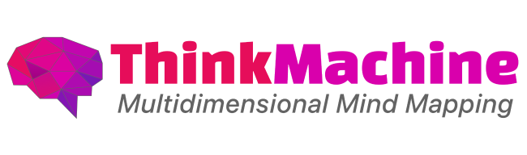

## Think Machine Web



<div class="badges" style="text-align: center; margin-top: -10px;">
<a href="https://github.com/themaximalist/thinkmachine"></a>
<a href="https://github.com/themaximalist/thinkmachine"></a>
<a href="https://github.com/themaximalist/thinkmachine"></a>
</div>
<br />

Think Machine is a multidimensional mind mapper for the Web.  It creates a 3D interface for exploring complex ideas, brainstorming and performing research.


Features
* 3d and 2d mind mapping
* Learn ideas inside and out
* AI graph brainstorming
* Chat with AI about knowledge graph
* Manage interconnections with a click
* Search, filter and go down rabbit holes
* and a lot more!

Learn more at [https://thinkmachine.com](https://thinkmachine.com) or <a href="https://app.thinkmachine.com">Try it now!</a>


Think Machine also has a desktop version you can access in the root of this repo, under `electron`.

## Install

Think Machine requires a Postgresql database setup before install.

```bash
cp .env.template .env # edit
npm install
```


## Development


```bash
npm run dev
```

You can access Think Machine at http://localhost:3000


## Projects

Think Machine is currently used in the following projects:

-   [ThinkableType](https://thinkabletype.com)
-   [Think Machine](https://thinkmachine.com)

## Author

-   [The Maximalist](https://themaximalist.com/)
-   [@themaximal1st](https://twitter.com/themaximal1st)

## License

MIT
